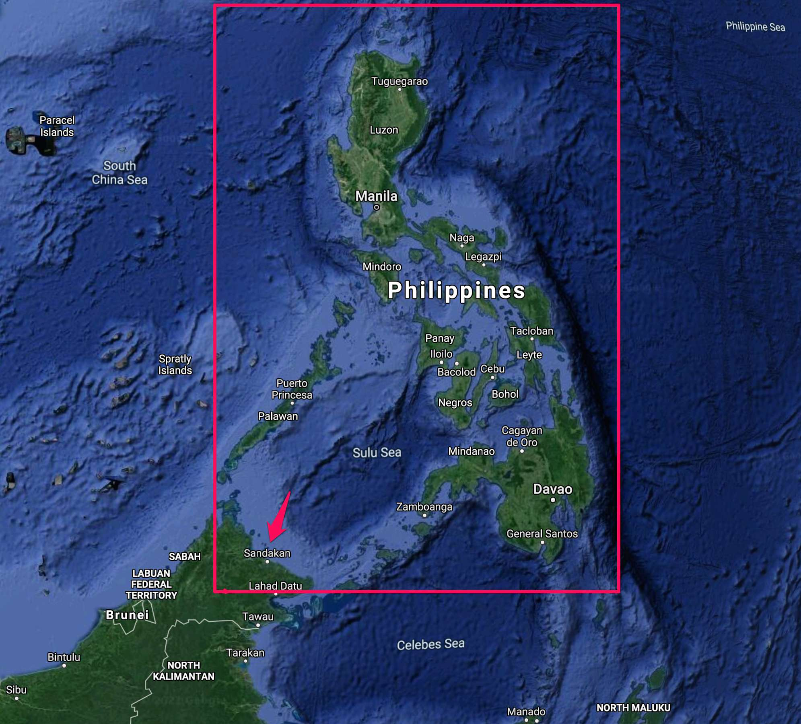
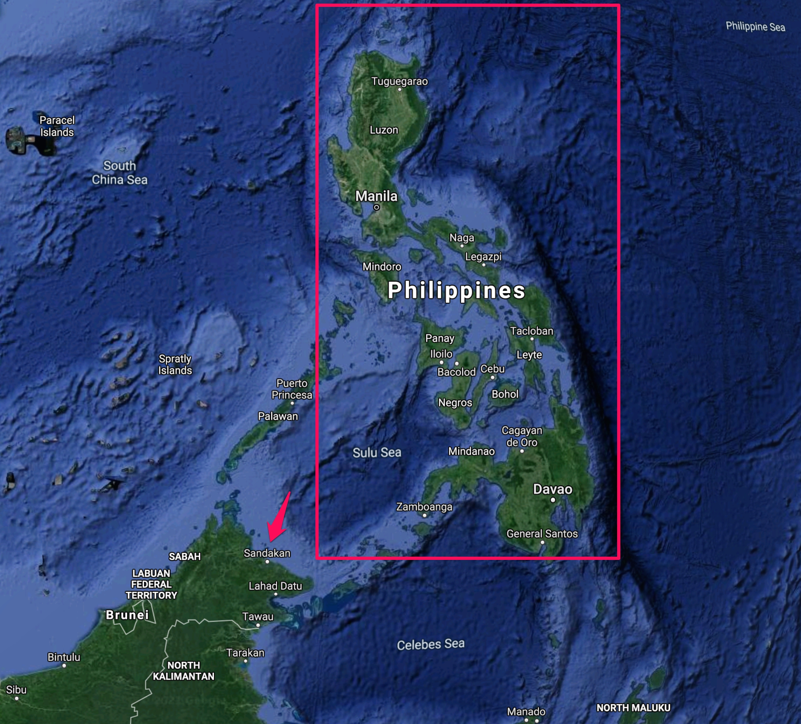
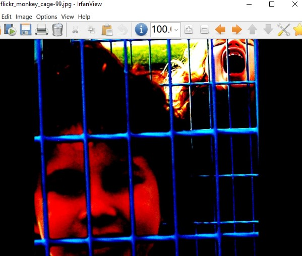
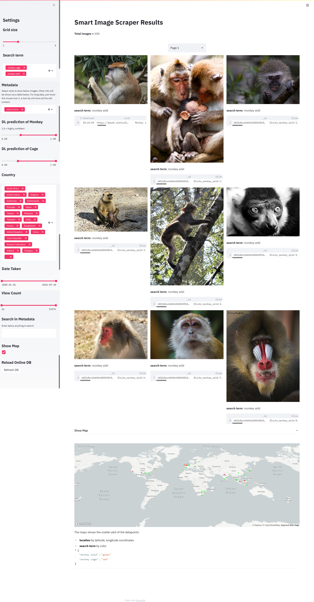

# Smart Image Scraper

The directory contains a Flickr scraper code that can be used to download images and a wealth of metadata using the Flickr API. Generally, the signal-to-noise ratio is high with search terms in Flickr. However, a few percent of images will not be quite right in terms of search of relevance due to multiple factors. For instance, if the search term has been mentioned in the description of the image in Flickr, it will show up in the results, even if that search query is not presented in the image itself.

To clean the images, another script has been included to apply Google Vision API image labeling service using deep convolutional neural networks trained by Google. The script will attach prediction scoring values which are showing how is the deep learning model confident on the availability of the search terms in the picture. Later on the user can decide what to do with these confidence scores. Assigning a threshold value is suggested to wade out all images that have less scores below a certain confidence threshold.

A third script will encrypt the sensitive information scraped using an automatically random encryption key. This key can be used later on when decryption of this kind of info is necessary. Importantly, the database files will be served online or stored in disk drives and this will protect the scraped data from any potential security threats. The script will also generate NoSQL MongoDB database on a local (or online) MongoDB client for the scraped data.

Here is a [web app](https://smart-image-scraper.herokuapp.com/) that has been developed using the code in this repo which uses more than 10 data analysis tools to clean the dataset using deep learning, analyze and visualize the the distribution, habitat use, and conservation status of Monkey species around the world. 

## Features

* Image scraper with a wealth of metadata downloaded from Flickr
* EXIF data extractor from the image files (Flickr API does not provide a way to download them)
  
* Smart cleaning of the images to enhance the signal-to-noise ratio using Deep Learning models by Google Vision API.
  
* Country and city information extraction which is not provided by Flickr API. Only longitude and latitude data available through the API. However, the script will infer the country and the city from those geotags by Reverse Geotagging of the images. This can be used later to even more filtering out the scraped images since a region of interest is sometimes not represented as a box (countries, cities..etc.). This can result in cleaner data confined to a certain country/city.
  
* Ability to limit the downloaded images from a certain box of region by assigning the minimum and maximum longitude and latitude in the search query step. This is performed through the Flickr API and not locally, which can potentially be better in terms of quantity of the results since the filtering is carried out on all Flickr servers rather than on our local scraped images, where the upper bound is not limited by the number of our scraped images.
  
* The search terms and scraped data can be in multiple languages. In our experiments, it showed that if we search the same term translated into multiple languages other than only English, the results of the searched images will be much more in quantity. For instance, searching for a monkey can be repeated with the search term in Italian, Spanish, Japanese, French, German, Chinese, Arabic, Russian...etc. The code respects the different encoding of the characters that are necessary to show texts in multiple languages.

* Deploying the scraped image and metadata browser web app on Heroku. It has more than 10 filtering and visualization methods already built in.


## Installation

1. Clone the repo
2. Create an Anaconda-environment 
````python
   conda create --name YOUR_ENV_NAME python=3.7
````
or alternatively a virtual-environment

3. Install requirements
````python
pip install -r requirements.txt
````
4. The package `reverse_geocode` is not up-to-date and will result in runtime errors. Hence, install the most up-to-date package from GitHub:
```python
pip install git+https://github.com/richardpenman/reverse_geocode
```
On Windows machines, there is a bug in the library above, where it is needed to deal with data that specifies encoding explicitly in case it isn't utf-8.

So we need to install this PR request version (in case the PR has not been merged yet):
```python
pip install git+https://github.com/richardpenman/reverse_geocode.git@0cde8566def3bd366a45b324909b640f97085a3d
```

5. If you want to clean mislabelled scraped images with deep learning, the script `prediciton_scoring.py` will send the image one by one to Google Vision API to label them with Google's deep learning model, you will need to setup Google cloud project for that (as shown in the below steps). 
   
The response from the cloud will be useful to provide the score of confidence of the model on whether there is a monkey or cage for example in the image. These scores will be saved in the database and can be used to wade out those images that have scores < 0.50.

1. Browse here: https://cloud.google.com/vision/
2. Create a Google account. You might be lucky and get $300 of free usage.
3. Activate the Vision API with the free trial.
4. Browse here: https://console.cloud.google.com/apis/credentials
5. Go to the credentials tab and create a new one. Create Credentials > API Key.
6. Save the KEY in the credentials.json file

example: {"FLICKER_KEY":"YOUR_API_KEY", "FLICKER_SECRET":"YOUR_API_SECRET", "GOOGLE_VISION_KEY":"YOUR_API_KEY"}

## Summary of Usage

* Start by running a search term and choose to download the images and metadata with a command like this in Terminal/Command prompt. (-s: search term ; -n: number of images ; -d: download images? Ture or False)

```python
python flickr_scraper.py -s "monkey wild" -n 10 -d True
```
* The images will be saved in `image` folder inside the project directory. The metadata will be temporarily saved in Pandas Dataframes inside the 'output' folder. These files should be deleted after completing all the steps since no encryption yet has been applied to the sensitive information of the scraped metadata at this step yet. 

The  `flickr_scraper.py` script can be repeated as many times as wished with different search terms and conditions. In later steps, minor modifications to the code should be applied to rename the pandas dataframes which will be combined into one dataframe of all search queries.

* If you would like to clean the data using Google Vision API, run the script `prediction_scoring.py`. The scores of the predictions will be saved in the same temporary Pandas DataFrames.
  
* Run `pd_to_mongodb_converter.py` to convert the Pandas DataFrames into MongoDB. Please note, you should have MongoDB installed locally or you should use your own MongoDB server online for this step.

* Deploy `web-app.py` to Heroku, after Exporting the local database to MongoDB Atlas Database (Cloud DBaaS for MongoDB) to make the web app able to see the changes or additions in the online database. You need to set environment variables in Heroku to put the encryption key and MongoDB Atlas password in them, otherwise the app will ask you for both `PASSW_DB.txt` and `KEY_DB.txt` files everytime the dyno restarts.
Example:
  ```python
    heroku config:set SECRET_KEY="YOUR_SECRET_KEY_VALUE" --app APP_NAME
    heroku config:set SECRET_PASSWORD="YOUR_SECRET_PASSWORD" --app APP_NAME
  ```


## Usage details

1. Create a Flickr account or sign-in
2. Get an API Key from: https://www.flickr.com/services/apps/create/apply
3. Create a file in the project directory named `credentials.json` and write your API key and Secret (and later for Google Vision API or other APIs) inside the file as:
```python
{"FLICKER_KEY":"YOUR_API_KEY", "FLICKER_SECRET":"YOUR_API_SECRET", "GOOGLE_VISION_KEY":"YOUR_API_KEY"}
```

### Metadata and associated text 

The script saves the following metadata from the scraped images: 

    ['search term', 'date of download', 'time of download', 'filename', 'link',
    'title', 'description', 'date taken', 'owner name', 'path alias', 'owner',
    'latitude', 'longitude', 'country', 'city', 'machine tags', 'views', 'tags',
    'exif data', 'species prediction score', 'cage prediction score']

### EXIF data

EXIF data is being populated from the image file itself since the Flickr api does not provide EXIF data retrieval, despite that Flickr shows them in the web. I have considered scraping EXIF info from the website using Beautiful Soup library since EXIF contains a wealth of information (~400 data fields) that can be quite useful. However, EXIF data retrieval from the image files themselves proved to be more efficient.

There are around _400 data items_ that can be stored in an image EXIF metadata. This [table](https://exiftool.org/TagNames/EXIF.html) lists all EXIF tags that can exist with any image file. Of course, not all images have been saved by the users contain EXIF and certainly not all images come with ALL EXIF data. Still, most images have tens or hundreds of such info and it is quite interesting to find this well of data from the downloaded images.

### EXIF Privacy and security

Since the Exif tag contains metadata about the photo, it can pose a privacy problem. For example, a photo taken with a GPS-enabled camera can reveal the exact location and time it was taken, and the unique ID number of the device - this is all done by default - often without the user's knowledge. Many users may be unaware that their photos are tagged by default in this manner, or that specialist software may be required to remove the Exif tag before publishing. For example, a whistleblower, journalist or political dissident relying on the protection of anonymity to allow them to report malfeasance by a corporate entity, criminal, or government may therefore find their safety compromised by this default data collection. [Source: [Wikipedia](https://en.wikipedia.org/wiki/Exif)]

Hence, in this project EXIF info and all other scraped metadata that contains sensitive or personal information (like names, personal, locations, ..etc) are encrypted.

The script `pd_to_mongodb_converter.py` is performing the encryption process before saving the data in MongoDB. Also, there is an `assert` verification step performed that ensures the decrypted versions of the data files are the same as the original, to validate that the encryption is done perfectly.

The `cryptography` Python library was used which includes the Fernet recipe, a best-practices recipe for using cryptography. Fernet is an open standard, with ready implementations in a wide range of programming languages and it packages AES CBC encryption for you with version information, a timestamp, and an HMAC signature to prevent message tampering.

Fernet makes it very easy to encrypt and decrypt messages and keep you secure. It is the ideal method for encrypting data with a secret.

The sensitive fields encrypted are: `'owner name', 'path alias', 'owner', 'exif data'`

### Geographical bounding box argument
**bbox (Optional)**

this argument can be added to the command line of `flickr_scraper.py` as `--bbox` or `-b`.

A comma-delimited list of 4 values defining the Bounding Box of the area should follow that will assign the geographical area to be searched.

The 4 values represent the bottom-left corner of the box and the top-right corner, minimum_longitude, minimum_latitude, maximum_longitude, maximum_latitude.

Longitude has a range of -180 to 180 , latitude of -90 to 90. Defaults to -180, -90, 180, 90 if not specified.

bbox should be: _minimum_longitude, minimum_latitude, maximum_longitude, maximum_latitude_

**Please note that not all images have been uploaded with longitude and latitude metadata in Flickr.** Images that have no such information are tagged with long:0 lat:0. 

Also, note that this is a square bounding box which not necessarily confined to a certain country if its landscape is quite different from a square.

For converting N,S,E,W into a range of -180 to 180 and latitude of -90 to 90 use the same numbers but replace the N,S,E,W into negative/positive signs:

N latitude = positive

S latitude = negative

E longitude = positive

W longitude = negative

**For example:**

The Philippines is located between 116° 40', and 126° 34' E longitude and 4° 40' and 21° 10' N latitude

So, in order to download 10 images taken in this bounding box location use:
````python
python flickr_scraper.py -s "monkey wild" -n 10 -d True -b "116 4 127 22"
````

### Testing the geographical bounding box

With the above search parameters, I found that some of the image descriptions stated that the images are captured in Sandakan, Malaysia. Like this image (Note its description scraped from Flickr):

<p align="center">
  
  <br><i>Flickr metadata (Description): Sepilok Orangutan Rehabilitation Centre is located about 25 kilometres west of <b style="color:blue;">Sandakan in the state of Sabah, Malaysia</b>. The centre opened in 1964 as the first official orangutan rehabilitation project for rescued orphaned baby orangutans from logging sites, plantations, illegal hunting or kept as pets. The orphaned orangutans are trained to survive again in the wild and are released as soon as they are ready. The sanctuary is located within the Kabili-Sepilok Forest Reserve which covers an area of 4,294 ha (10,610 acres), much of which is virgin rainforest. Today around 60 to 80 orangutans are living free in the reserve. It has become one of Sabah's tourist attractions. In October 2014 the centre opened a new section where visitors can view the nursery area where the younger Orangutans first learn to be outside and play on a large climbing frame. This consists of 2 large indoor seating areas (one with air conditioning and one with fans only) with a large window that overlooks the play area. There is no additional charge to enter this part of the centre.</i>
</p>

This was part of the results of the bounding box of the Philippines, because Sandakan's coordinates are:

5.8394° N, 118.1172° E

which is located inside the bbox of the Philippines. Even if we use a more accurate search for the Philippines by using fractions of long and lat coordinates (converting the minutes degrees into decimal fractions), we could not exclude the above image result. Sandakan is simply located in the part of the requested area:
````python
python flickr_scraper.py -s "monkey wild" -n 10 -d True -b "116.66 4.66 126.56 21.16"
````

<p align="center">
  
  <br><i>The bounding box showing that Sandakan (a Malaysian city) located inside the bounding box of the Philippines.</i>
</p>

Let's test if we intentionally reduce the size of the bbox area in a way to cut out some of the outer parts of the Philippines, to exclude Sandakan from the bbox range of coordinates by using:
````python
python flickr_scraper.py -s "monkey wild" -n 10 -d True -b "119 6 127 22"
````

<p align="center">
  
  <br><i>Smaller bbox area than the actual area of the Philippines that excludes Sandakan, Malaysia.</i>
</p>

We see that the above result has indeed been excluded. 

Furthermore, here are two examples resulted which are indeed from the Philippines: 


<p align="center">
  
  <br><i>Flickr metadata (Description): On the island of Bohol, The <b style="color:blue;">Philippines</b> live these interesting looking creatures.  An endangered species, we saw this one at a semi wild conservation centre near Corella in Bohol called: Tarsier Research and Development Center.\n\nWith incredibly good hearing and being nocturnal, we had to sneak around this enclosure to not disturb them too much.  Whilst open to tourists, only a small section is viewable leaving the rest of the population in peace.\n\nShot with a Nikon D3200 and a Nikon AF-S 70-300mm f\/4.5-5.6 VR</i>
</p>

***

<p align="center">
  
  <br><i>Flickr metadata (Description): I wanted to identify this bird hiding among the bushes. I did a quick google search when I got home to see if I could ID it. So, literally the first thing I Googled was &quot;Philippines white fantail&quot;. And there it was... Philippine Pied Fantail (Rhipidura nigritorquis)- at least that's what it looks like to me. Lucky first guess!!! This guy (or girl?) lived in a small patch of forest right next to the nipa hut we were staying in. I saw him (or her?) there on several occasions. It even got territorial after the neighborhood kids let the <b style="color:blue;">monkey</b> go from the mango tree (yes, you read that right!) Masaki, the <b>monkey</b>, wondered down to that small patch of forest with the harness still on her waist (and severed leash dragging behind her) and was immediately attacked by this little birdie.</i>
</p>

Note that the previous image was for a bird in the Philippines. However, we are searching for monkeys in the wild. That's because in the description in Flickr the user mentioned monkey. 

This shows how important is to clean the images. 

### A better way to find images taken in a certain city or country

I used `reverse_geocode` python package to convert the longitude and latitude retrieved from the Flickr API to reverse geotag them into city and country names. So the better way perhaps is to scrape images without the `bbox` option, and filter the images later according to the desired country or city. The downside of this method is that it does not search all Flickr images on its servers. So the pool of images that we are picking from is limited by what we have scraped. 

So the best way is to use `bbox` with an area covering the whole country of interest and then filter further using the country metadata saved by this script.

## How to clean the scraped images

As we can see in the previous image, not all scraped images will be accurately presenting the search terms. Simply because maybe the user uploaded the picture and mentioned the search term for another reason in the discussion or the title, even if it did not show in the picture's content.

Perhaps, the best way is to use a manual curation method like  Amazon Mechanical Turk. However, a much cheaper and faster option would be to scrape 10,000 images with the search term _cage_ and another 10,000 images with the search term _monkey_ for example and train a deep learning multi-label CNN classifier on those images. This will allow us to assign prediction scores to each scraped image to indicate what is the probability of the presence of cage and monkey in each image. Later on, we can decide and set a threshold of prediction score probabilities to wade out low confident CNN prediction images from our dataset.

For example, one of the image search results in flickr for the search term _monkey cage_ returned the following image:

<p align="center">
  
  <br><i>Flickr metadata (Title): <b>Monkey</b> cage.</i>
</p>

And it is obvious that the user when uploaded the image and made the title _Monkey cage_, it was not meant that in the cage was a monkey. So for such case, the deep learning cleaning method is very useful. Indeed, with the implemented Google Vision API use, the prediction score showed that there are no monkeys in the above image.


**6. If you wish to deploy a web app** that browses the scraped images and its metadata, `web-app.py` is just doing that with a wealth of data analysis tools. The deployed web app for this project is [here](https://smart-image-scraper.herokuapp.com).

## Here are some of the features built in the web app:
* The web app now can browse all my scraping images and metadata (reading them from an online NoSQL database). 
* Search inside the metadata and return the findings. 
* Apply deep learning prediction threshold to clean the scraped dataset.
* Show the pictures in a resizable gallery with grids from 1x1 up to 8x8. Even on mobile phones, the layout is responsive!.
* Metadata shown as a table below each image that can be expanded to full screen.
* Filter data according to a chosen country with the ability to multi-select countries if needed.
* Plotting the pictures taken on the World map according to the GPS Geotags of the scraped metadata.
* Filtering out according to View counts in Flickr.
* Reloading the database from MongoDB Atlas in case the online database has been updated with new information.
* Recording a screencast for the user's browsing of the web app and save it as a video file.
* Easily updating from Github to Heroku for any changes in my app.

<p align="center">
  
  <br><i>Deployed web app for this project <a href="https://smart-image-scraper.herokuapp.com">(Link)</a></i>
</p>


## Future work and enhancements
* We could do better than Google Vision API. If we train our own deep learning model on the search terms by several thousands of scraped training data, potentially that can be a better customized model than what Google is providing. The Google Vision API is serving a DL model that has been [trained on ~20K of labels](https://stackoverflow.com/a/57649116/1970830), which can be quite challenging in terms of prediction accuracy. If we train on only a few search terms that we are interested in, the model will be much better. Besides, Google Vision API will not give labels that have lower than 0.5 confidence scores. In our experiments, we noticed that this threshold is relatively high and a few little vague monkey pictures are missed. If they would allow to set a lower threshold like 0.2 and let the user decide and pick her/his own threshold, that would be much better and flexible. In fact, I intend to build a web app that has a slider to assign the threshold for scores of cage and another slider for the threshold of monkeys predictions. By playing with these two sliders, the user can see in real-time interaction with the image thumbnail list what is the optimum threshold values to choose.
  
* Scraping the comments on the Flickr website. Retrieving the comments on images is not part of the Flickr API yet as shown in [FLickr API documentation](https://www.flickr.com/services/api/flickr.photos.search.html), By using beautifulsoup Python library we can scrape this information too.
  
* Adding image scraping through other Search engines like the [BING image search api](https://www.microsoft.com/en-us/bing/apis/bing-image-search-api). Google previously provided an image search API as well, but it discontinued the service. However, traditional scraping methods can still be used to scrape from Google search results using browser automation libraries in Python like [Selenium](https://selenium-python.readthedocs.io) and [beautifulsoup HTML scraping Python library](https://pypi.org/project/beautifulsoup4/). A nice tutorial on using Bing search API can be found in this article: [how-to-quickly-build-a-deep-learning-image-dataset](https://www.pyimagesearch.com/2018/04/09/how-to-quickly-build-a-deep-learning-image-dataset/).
  
* Data mining using text and image DL methods. For example, a multi-modal DL model that uses both text and image data in training can be used to infer more accurate meaning and content recognition on the scraped images. Example of such a method in this project: [Image-Captioning-System--Deep-learning](https://github.com/vinaybysani/Image-Captioning-System--Deep-learning).


<p align="center">
  
  <br><i>Combining Image and Language model <a href="https://github.com/vinaybysani/Image-Captioning-System--Deep-learning">(source)</a></i>
</p>

<p align="center">
  
  <br><i>Combining Image and Language model <a href="https://github.com/vinaybysani/Image-Captioning-System--Deep-learning">(source)</a></i>
</p>


