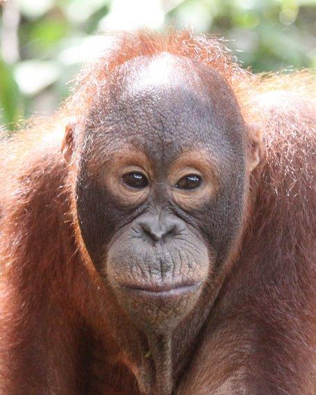
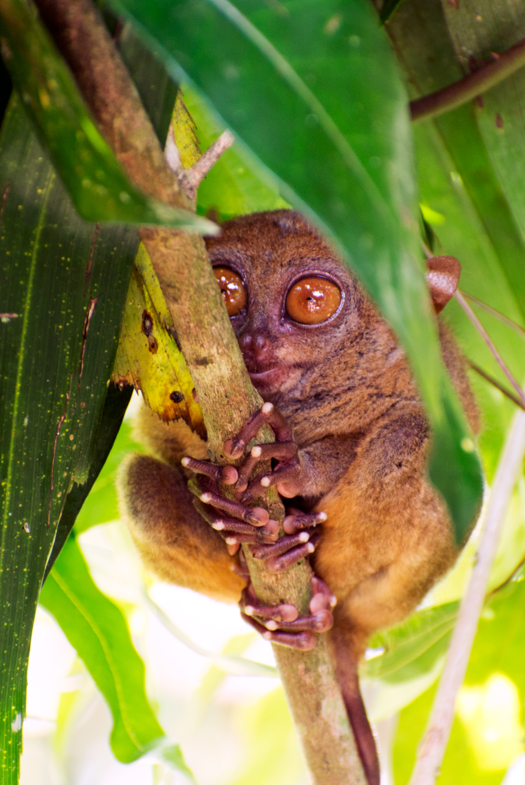
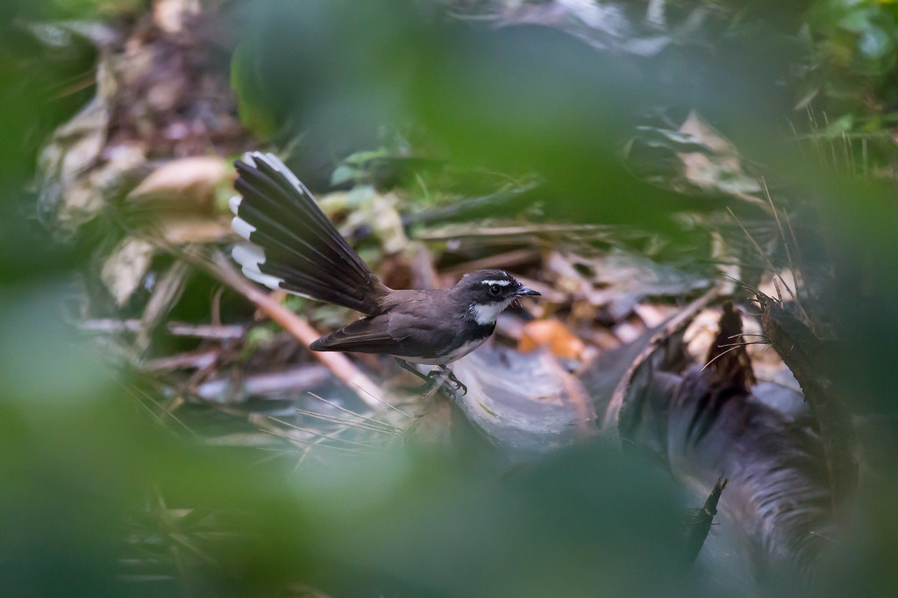

# Smart Image Scraper

## Installation

1. Clone the repo
2. Create an Anaconda-environment 
````python
   conda create --name YOUR_ENV_NAME python=3.7
````
or alternatively a virtual-environment

3. Install requirements
````python
pip install -r requirements.txt
````

## Usage

1. Create a flickr account or sign-in
2. Get an API Key from: https://www.flickr.com/services/apps/create/apply
3. Create a file in the project directory named `credentials.json` and write your API key and Secret inside the file as:
```python
{"KEY":"YOUR_API_KEY", "SECRET":"YOUR_API_SECRET"}
```

## Geographical bounding box
**bbox (Optional)**

A comma-delimited list of 4 values defining the Bounding Box of the area that will be searched.

The 4 values represent the bottom-left corner of the box and the top-right corner, minimum_longitude, minimum_latitude, maximum_longitude, maximum_latitude.

Longitude has a range of -180 to 180 , latitude of -90 to 90. Defaults to -180, -90, 180, 90 if not specified.

bbox should be: _minimum_longitude, minimum_latitude, maximum_longitude, maximum_latitude_

**Please note that not all images has been uploaded with longitude and latitude metada in flickr.** Images that has no such information are tagged with long:0 lat:0. 

Also note that this is a square bounding box which not necessarily confined to a certain country if its landscape is quite different from a square.

For converting N,S,E,W into range of -180 to 180 and latitude of -90 to 90 use the same numbers but replace the N,S,E,W into negative/positive signs:

N latitude = positive

N latitude = negative

E longitude = positive

W longitude = negative

**For example:**

Philippines is located between 116° 40', and 126° 34' E longitude and 4° 40' and 21° 10' N latitude

So, in order to download 10 images taken in this bounding box location use:
````python
python flickr_scraper.py -s "monkey wild" -n 10 -d True -b "116 4 127 22"
````

### Testing the geographical bounding box

With the above search parameters, I found that some of the image descriptions stated that the images are captured in Sandakan, Malaysia. Like this image (Note its description scraped from Flickr):

<p align="center">
  
  <br>Sepilok Orangutan Rehabilitation Centre is located about 25 kilometres west of Sandakan in the state of Sabah, Malaysia.\n\nThe centre opened in 1964 as the first official orangutan rehabilitation project for rescued orphaned baby orangutans from logging sites, plantations, illegal hunting or kept as pets. The orphaned orangutans are trained to survive again in the wild and are released as soon as they are ready. The sanctuary is located within the Kabili-Sepilok Forest Reserve which covers an area of 4,294 ha (10,610 acres), much of which is virgin rainforest. Today around 60 to 80 orangutans are living free in the reserve. It has become one of Sabah's tourist attractions.\n\nIn October 2014 the centre opened a new section where visitors can view the nursery area where the younger Orangutans first learn to be outside and play on a large climbing frame. This consists of 2 large indoor seating areas (one with air conditioning and one with fans only) with a large window that overlooks the play area. There is no additional charge to enter this part of the centre.
</p>


This was part of the results, because Sandakan's coordinates are:

5.8394° N, 118.1172° E

which are located inside the bbox of Philipines. Even if we use more accurate search for philipine by using fractions (converting the minutes into decimal fractions):
````python
python flickr_scraper.py -s "monkey wild" -n 10 -d True -b "116.66 4.66 126.56 21.16"
````

we could not exclude the above result. Simply Sandakan, Malaysia located in part of the requested area.

Let's test if we intentionally reduce the bbox area to exclude Sandakan coordinates by using:
````python
python flickr_scraper.py -s "monkey wild" -n 10 -d True -b "119 6 127 22"
````

We see that the above result has been indeed excluded. These are two examples resulted which are indeed from the Philipines: 


<p align="center">
  
  <br>Flickr metadata (Description): On the island of Bohol, The <b>Philippines</b> live these interesting looking creatures.  An endangered species, we saw this one at a semi wild conservation centre near Corella in Bohol called: Tarsier Research and Development Center.\n\nWith incredibly good hearing and being nocturnal, we had to sneak around this enclosure to not disturb them too much.  Whilst open to tourists, only a small section is viewable leaving the rest of the population in peace.\n\nShot with a Nikon D3200 and a Nikon AF-S 70-300mm f\/4.5-5.6 VR
</p>


<p align="center">
  
  <br>Flickr metadata (Description): I wanted to identify this bird hiding among the bushes. I did a quick google search when I got home to see if I could ID it. So, literally the first thing I Googled was &quot;Philippines white fantail&quot;. And there it was... Philippine Pied Fantail (Rhipidura nigritorquis)- at least that's what it looks like to me. Lucky first guess!!!\nThis guy (or girl?) lived in a small patch of forest right next to the nipa hut we were staying in. I saw him (or her?) there on several occasions. It even got territorial after the neighborhood kids let the monkey go from the mango tree (yes, you read that right!) Masaki, the <b>monkey</b>, wondered down to that small patch of forest with the harness still on her waist (and severed leash dragging behind her) and was immediately attacked by this little birdie.
</p>

Note that the previous image was for a bird in the Philippines. However, we search for monkey in the wild. That's because in the description in flickr there was a mention of a monkey. 

So this shows how important is to clean the images.

## How to clean the scraped images

As we can see in the previous image above, not all scraped images will be accurately presenting the search terms. Simply because maybe the user uploaded the picture mentioned the search term for an another reason, even if it did not shown in the picture.

Perhaps, the best way is to use a manual curation method like  Amazon Mechanical Turk. However, much more cheaper and faster option would be to scrap 10,000 images with the search term _cage_ and another 10,000 images with the search term _monkey_. Then train a deep learning multi-label CNN classifier on those images. This wil allow us to assign prediction scores to each scraped image to indicate what is the probability of the presence of cage and monkey in each image. Later on we can decide the set a threshold of prediction score probabilities to wade out low confident CNN prediction images from our dataset.

